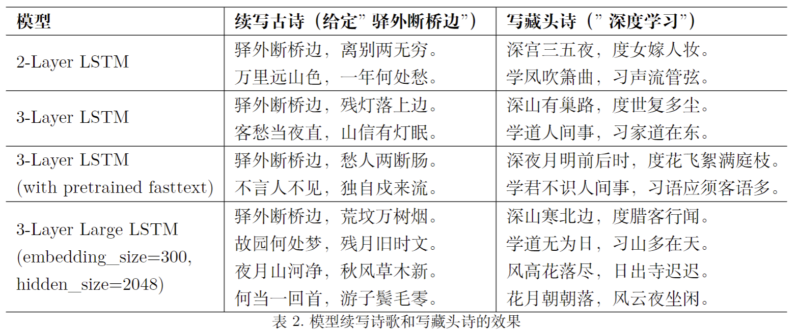

## Generating Chinese Poetry Based on LSTM

- Course Project for Deep Learning in UCAS
- Please read write_poetry.ipynb to understand the poem generation process
- The results of different models are in Results.txt

